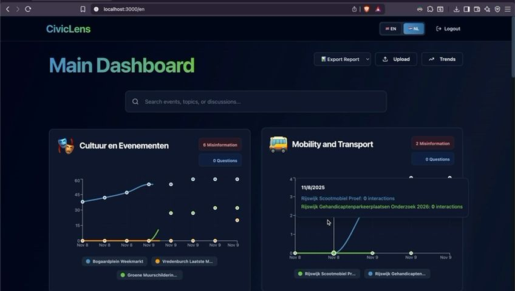
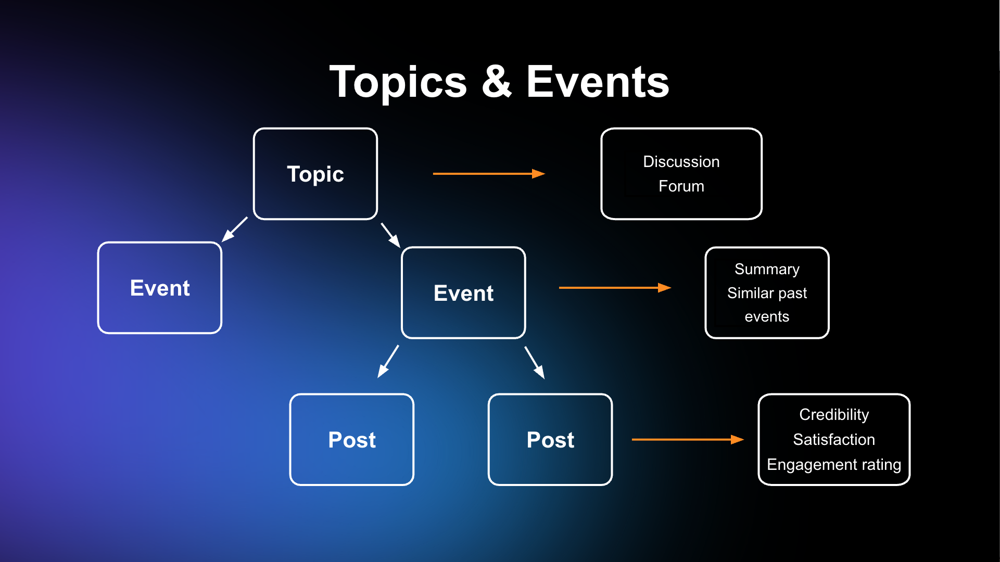

# CivicLens

**Actionable civic insights through human–AI collaboration**  
Built at Polderr Hackathon · 9 November 2025



- **PowerPoint slides:** [CivicLens Pitch Deck](https://docs.google.com/presentation/d/1472G3EdpkMCCunGx3ZUON4YZgGW5lHYfpXWC7Huqywc/edit?usp=sharing)  
- **Demo video:** [YouTube Showcase](https://youtu.be/09zDyZ6ZXKo)

---

## Team
- [Teodor Neagoe](https://www.linkedin.com/in/teodor-neagoe/)
- [Sebastian (Casian) Chiriac](https://www.linkedin.com/in/sebastian-chiriac-86a907241/)
- [Rares Andrei Popa](https://www.linkedin.com/in/rares-andrei-popa-931846169/)
- [Stefan Voicila](https://www.linkedin.com/in/stefan-voicila-84ab3b27a/)

---

## Problem
Municipalities and civic actors often struggle to:
- Keep a high-level overview of local issues  
- Track short-term and long-term trends  
- Detect misinformation early  
- Extract actionable insights from fragmented online discussions  

Relevant information exists but is scattered across forums, local news, and discussions, making synthesis slow and manual.

---

## Solution
CivicLens aggregates public online sources and turns them into **structured, actionable civic intelligence**, combining AI analysis with human collaboration.  

**Key idea:** Humans and AI work together on real civic problems, using shared context and verified sources.

---

## Core Features
- **Local search engine** for news and discussions (USP)  
- **AI-assisted summarization** of events, topics, and discussions  
- **Human–AI collaboration** via topic-based forums (USP)  
- **Trends overview** (short & long term)  
- **Misinformation detection and flagging**  
- **Ready-to-send reports** generated from discussions  
- **Supports multiple input formats**: forums, articles, posts  



---

## Sources
**Main:** Online forums, local news feeds  
**Considered:** Social media, additional online forums  

> Assumption: Public websites can be legally parsed as long as no personal data (e.g., usernames) is stored.

---

## Getting started

### Backend http://localhost:8000/docs

```bash
pip install -r requirements.txt
```

```
brew install ffmpeg
```

```
ollama pull qwen3-vl:4b-instruct
```

```bash
python -m api.main
```

### Frontend http://localhost:3000


```bash
cd munincipalitator3000
npm run dev
```

### Re-generate the json with the data

```
python main_generate.py
```

### Models were using
- locally hosted via ollama : qwen3-vl:4b-instruct for image to text for eval newspapers etc...
- azerion hosted
    - elevenlabs-scribe for speech to text
    - gemini-embedding-001 for embeddings 
    - mistral-large-2407-v1:0 for nlp decision making

Showcase via sample.png and sample.mp4

### AI ChatBot

To activate, use: 
`Hey, PolderrAI`